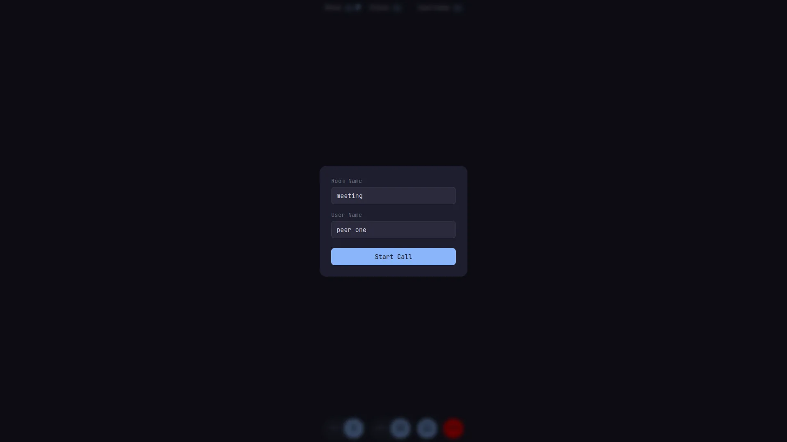
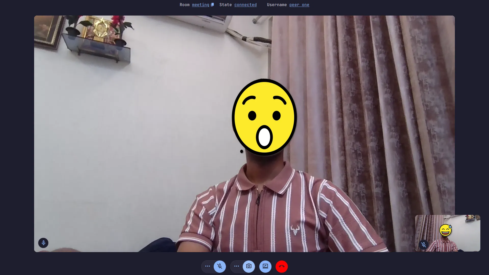
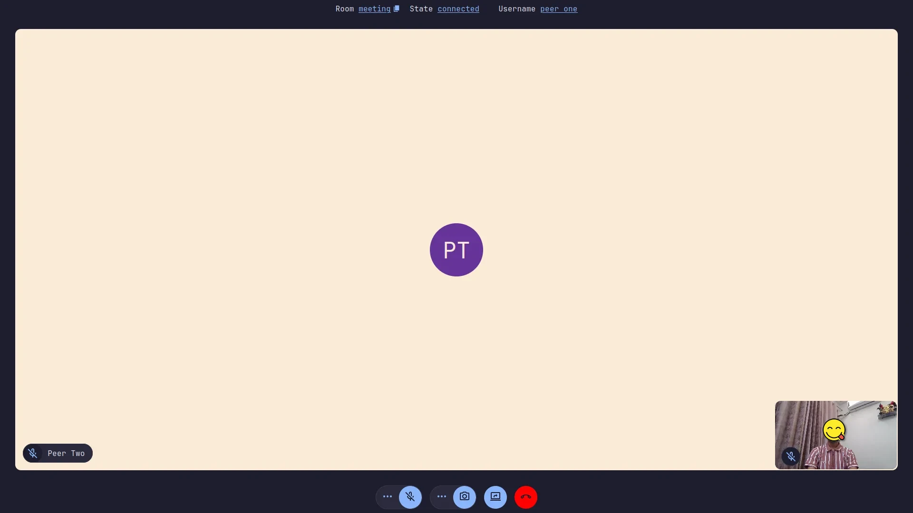

# Peer Connect
A WebRTC client for video calling.

## Images

<picture>
<source media="(prefers-color-scheme: dark)" srcset=".github/assets/images/screenshot-1.webp"></source>
<source media="(prefers-color-scheme: light)" srcset=".github/assets/images/screenshot-1-light.webp"></source>

</picture>

<picture>
<source media="(prefers-color-scheme: dark)" srcset=".github/assets/images/screenshot-2.webp"></source>
<source media="(prefers-color-scheme: light)" srcset=".github/assets/images/screenshot-2-light.webp"></source>

</picture>

<picture>
<source media="(prefers-color-scheme: dark)" srcset=".github/assets/images/screenshot-3.webp"></source>
<source media="(prefers-color-scheme: light)" srcset=".github/assets/images/screenshot-3-light.webp"></source>

</picture>

## Setup

### Client

```bash
pnpm install
pnpm run dev
```

> **Note**: It will only work if the app is running on `localhost` or on a `https` url.

### Server

```bash
cd server/
pnpm install
pnpm start
```

Expose the server port and put the url inside `.env` file's `VITE_SIGNALING_SERVER_URL` field.

## TODO
- [ ] Make mini-player draggable
- [ ] Isolate webrtc logic
- [ ] Add routes 
- [ ] Add screen share logic
- [ ] Add group chat
- [ ] Room creator should be able to accept and reject join requests
- [ ] Push to speak
- [ ] Alerts for errors, warning and general info